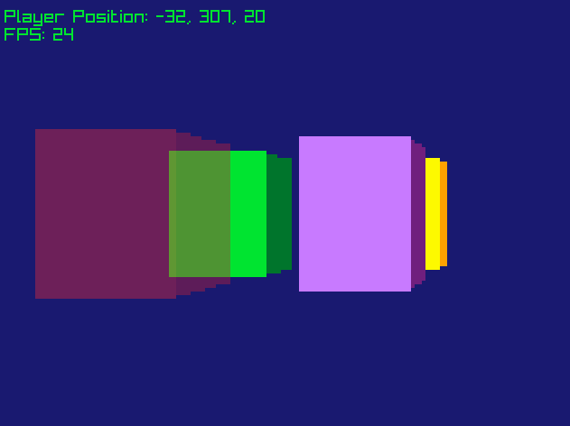
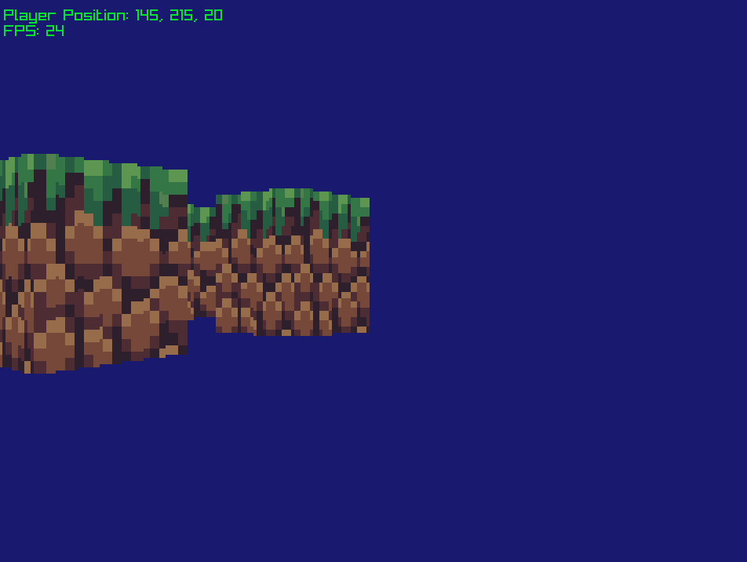

# Útulno-Doom-style-engine
### v0.0.9

A pseudo-3D engine made using Cpp and raylib.

## Features
- **Level Editor:** A visual way of creating levels.
- **Textures:** Walls and sectors with connected textures and clipping.

## Upcoming Features
- **Web Build:** Compile the project to WASM.
- **Collision:** A simple system of collisions checking if the future position crosses any wall segment.
- **Portals between sectors:** Create connected rooms, by allowing sectors to share walls and draw only when visible.

## Screenshots

## Getting started 🚀
Compile with the command `mingw32-make` and than run with `./Myslivcovi-Vzpominky.exe`.

## Controls 🎮
- **Camera:** WASD movement.
- **Space:** Move up.
- **Shift:** Move down.
- **Mouse:** Move camera angle.
- **Tab:** Open/Close level editor.
- **F5:** Save level.
- **Esc:** Exit game.

## Acknowledgments
Code based on tutorial by [3DSage](https://www.youtube.com/watch?v=huMO4VQEwPc)